# Universal Microfrontend Platform

A governed, cross-platform microfrontend platform enabling a **single React Native codebase** to power **Web, iOS, and Android** via runtime [Module Federation v2](https://module-federation.io/).

## Why This Platform Exists

- **Eliminate duplicated UI logic** across web and mobile — write components once using React Native primitives, render everywhere
- **Enable independent feature deployment** via runtime Module Federation without host redeployment
- **Enforce host-governed boundaries** — routing, authentication, and session lifecycle are owned by the host
- **Provide a scalable architecture** for multi-team frontend development with strict MFE isolation

## Architecture Overview

```
┌─────────────────────────────────────────────────────────────────────────────┐
│                              UNIVERSAL CODEBASE                             │
│  ┌───────────────────────────────────────────────────────────────────────┐  │
│  │                     Shared Packages (10 libraries)                    │  │
│  │  ┌─────────────┐ ┌─────────────┐ ┌─────────────┐ ┌─────────────────┐  │  │
│  │  │ shared-     │ │ shared-     │ │ shared-     │ │ shared-         │  │  │
│  │  │ hello-ui    │ │ auth-store  │ │ theme-ctx   │ │ design-tokens   │  │  │
│  │  │ (RN UI)     │ │ (Zustand)   │ │ (Provider)  │ │ (Two-tier)      │  │  │
│  │  └─────────────┘ └─────────────┘ └─────────────┘ └─────────────────┘  │  │
│  │  ┌─────────────┐ ┌─────────────┐ ┌─────────────┐ ┌─────────────────┐  │  │
│  │  │ shared-     │ │ shared-     │ │ shared-     │ │ shared-         │  │  │
│  │  │ i18n        │ │ a11y        │ │ event-bus   │ │ data-layer      │  │  │
│  │  │ (EN/HI)     │ │ (WCAG 2.1)  │ │ (MFE comm)  │ │ (React Query)   │  │  │
│  │  └─────────────┘ └─────────────┘ └─────────────┘ └─────────────────┘  │  │
│  │  ┌─────────────┐ ┌─────────────┐                                      │  │
│  │  │ shared-     │ │ shared-     │                                      │  │
│  │  │ router      │ │ utils       │                                      │  │
│  │  │ (Host-own)  │ │ (Storage)   │                                      │  │
│  │  └─────────────┘ └─────────────┘                                      │  │
│  └───────────────────────────────────────────────────────────────────────┘  │
└─────────────────────────────────────────────────────────────────────────────┘
                                      │
          ┌───────────────────────────┼───────────────────────────┐
          ▼                           ▼                           ▼
   ┌─────────────┐             ┌─────────────┐             ┌─────────────┐
   │     WEB     │             │   ANDROID   │             │     iOS     │
   │             │             │             │             │             │
   │ ┌─────────┐ │             │ ┌─────────┐ │             │ ┌─────────┐ │
   │ │web-shell│ │             │ │ mobile- │ │             │ │ mobile- │ │
   │ │ (Host)  │ │             │ │  host   │ │             │ │  host   │ │
   │ │ Rspack  │ │             │ │ Re.Pack │ │             │ │ Re.Pack │ │
   │ │ :9001   │ │             │ │ :8081   │ │             │ │ :8082   │ │
   │ └────┬────┘ │             │ └────┬────┘ │             │ └────┬────┘ │
   │      │ MF   │             │      │ MF   │             │      │ MF   │
   │      ▼      │             │      ▼      │             │      ▼      │
   │ ┌─────────┐ │             │ ┌─────────┐ │             │ ┌─────────┐ │
   │ │  web-   │ │             │ │ mobile- │ │             │ │ mobile- │ │
   │ │ remote  │ │             │ │ remote  │ │             │ │ remote  │ │
   │ │ :9003   │ │             │ │ :9004   │ │             │ │ :9005   │ │
   │ └─────────┘ │             │ └─────────┘ │             │ └─────────┘ │
   │             │             │             │             │             │
   │ RN Web      │             │ Hermes      │             │ Hermes      │
   │ Browser     │             │ Native      │             │ Native      │
   └─────────────┘             └─────────────┘             └─────────────┘
```

**Key Innovation**: Write UI once using React Native primitives (`View`, `Text`, `Pressable`) → renders via React Native Web on browsers, natively on mobile.

### Runtime Flow

```text
User Request → Host App → Remote Resolution → Dynamic Bundle Load → Shared Library Injection → Render
                  │              │                     │
                  │         Web: remoteEntry.js   Web: browser fetch
                  │         Mobile: ScriptManager Mobile: Hermes bytecode
                  │
                  └── Auth gate, route resolution, theme/i18n context provided by host

If a remote fails to load, the host provides graceful fallback UI and preserves session continuity.
```

### Host Governance Model

The host application enforces all cross-cutting concerns:

- **Routing** — Host defines all routes; MFEs are URL-agnostic and request navigation via event bus
- **Authentication** — Host owns Firebase session lifecycle; remotes receive auth state, never manage it
- **Shared Dependencies** — Singleton-enforced via Module Federation; host controls versions
- **Communication** — Inter-MFE messaging occurs only through the typed event bus; no direct imports between remotes
- **Deployment** — Remotes can be deployed independently, but the host controls which versions are loaded at runtime

## Tech Stack

| Layer | Web | Mobile | Shared |
|-------|-----|--------|--------|
| **UI Framework** | React 19.2.0 | React Native 0.80.0 / React 19.1.0 | React Native primitives |
| **Bundler** | [Rspack](https://rspack.dev/) 1.6.5 | [Re.Pack](https://re-pack.dev/) 5.2.0 | - |
| **Module Federation** | [@module-federation/enhanced](https://module-federation.io/) 0.21.6 | Re.Pack MF v2 Plugin | - |
| **JS Engine** | V8/SpiderMonkey | [Hermes](https://hermesengine.dev/) | - |
| **State** | - | - | [Zustand](https://zustand-demo.pmnd.rs/) 5.0.5 |
| **Data Fetching** | - | - | [TanStack Query](https://tanstack.com/query) 5.x |
| **Build Orchestration** | - | - | [Turborepo](https://turbo.build/) 2.7.3 |
| **Language** | - | - | TypeScript 5.9.3 |

## Features

### Platform Core

| Feature | Description |
|---------|-------------|
| **Universal UI** | React Native components render identically on Web, iOS, and Android |
| **Module Federation v2** | Runtime remote loading — deploy remotes independently without host redeployment |
| **Authentication** | Firebase Auth with Email/Password, Google Sign-In, and GitHub Sign-In |

### Cross-Cutting Concerns

| Feature | Description |
|---------|-------------|
| **Theming** | Light/dark mode with two-tier design token architecture and session persistence |
| **i18n** | English + Hindi localization, zero-dependency, works across all platforms |
| **Accessibility** | WCAG 2.1 AA compliant utilities for screen readers, roles, and focus management |
| **State Management** | Zustand stores with platform-agnostic storage abstraction |
| **Inter-MFE Communication** | Type-safe event bus for loose coupling between host and remotes |

### Developer Experience & CI/CD

| Feature | Description |
|---------|-------------|
| **Turborepo** | Cached build orchestration with dependency-aware task ordering |
| **Testing Pyramid** | Jest (unit), Playwright (web E2E), Maestro (mobile E2E) |
| **CI/CD** | Trunk-based development with mandatory E2E gates on all 3 platforms before merge |
| **Architecture Enforcement** | Custom ESLint rules prevent cross-MFE imports and DOM usage in shared packages |

## Quick Start

```bash
# Prerequisites: Node.js 24.x, Yarn 1.22.22

# Install & build
yarn install
yarn build:shared

# Web development (http://localhost:9001)
yarn workspace @universal/web-remote-hello dev   # Terminal 1
yarn workspace @universal/web-shell dev          # Terminal 2

# Mobile (requires Xcode/Android Studio)
# See docs/universal-mfe-all-platforms-testing-guide.md
```

## Project Structure

```
packages/
├── web-shell/              # Web host application
├── web-remote-hello/       # Web remote MFE
├── mobile-host/            # iOS & Android host
├── mobile-remote-hello/    # Mobile remote MFE
├── shared-hello-ui/        # Universal React Native components
├── shared-auth-store/      # Authentication state
├── shared-design-tokens/   # Primitive & semantic tokens
├── shared-theme-context/   # Theme provider
├── shared-a11y/            # Accessibility utilities
├── shared-i18n/            # Internationalization
├── shared-event-bus/       # Inter-MFE communication
├── shared-data-layer/      # React Query setup
├── shared-router/          # Routing abstraction
└── shared-utils/           # Pure TypeScript utilities
```

## Deployment

| Platform | Target | Trigger | Independence |
|----------|--------|---------|--------------|
| Web | [Vercel](https://vercel.com/) | Push to `main` | Host and remotes deploy independently |
| Android | Firebase App Distribution | Tag `v*` | Remote bundles deploy without app update |
| iOS Sim | GitHub Releases | Tag `v*` | Remote bundles deploy without app update |

### CI/CD Pipeline

```mermaid
flowchart LR
    PR[Pull Request]
    CI[CI Checks<br/>Lint, Type, Test, Build]
    E2E[E2E Tests<br/>Web + Android + iOS]
    Merge[Merge to main]
    Staging[Auto-Deploy Staging<br/>Vercel + Firebase]
    Tag[Git Tag v*]
    ProdE2E[E2E Re-verification]
    Prod[Production Release<br/>GitHub + Vercel + Firebase]

    PR --> CI
    CI -->|✓ Pass| E2E
    E2E -->|✓ All platforms pass| Merge
    Merge --> Staging
    Staging -.->|Manual trigger| Tag
    Tag --> ProdE2E
    ProdE2E -->|✓ Pass| Prod

    CI -->|✗ Fail| PR
    E2E -->|✗ Fail| PR
    ProdE2E -->|✗ Fail| Tag

    style Merge fill:#90EE90
    style Staging fill:#87CEEB
    style Prod fill:#FFD700
    style E2E fill:#FFA07A
    style ProdE2E fill:#FFA07A
```



**Core Invariant:** `main` is always releasable — all PRs must pass CI + E2E on all three platforms before merge.

## Multi-Team Scaling Considerations

This architecture supports multi-team development through:

- **Manifest-based version pinning** — Host controls which remote versions are loaded at runtime via manifest files
- **Backward-compatible shared library evolution** — Semantic versioning ensures remotes can upgrade independently without breaking changes
- **Remote rollback** — Host manifest override enables instant rollback of problematic remote versions without redeployment
- **CI validation for shared dependencies** — Automated checks prevent breaking changes to shared packages before merge
- **Staging environment version-skew detection** — Pre-production validation catches incompatibilities before production promotion

## Trade-Offs & Constraints

| Trade-Off | Rationale |
|-----------|-----------|
| Runtime MF adds version coordination complexity | Justified by independent deployment capability across teams |
| React Native Web increases web bundle size vs pure React | Justified by eliminating duplicated UI logic across 3 platforms |
| Cross-platform abstraction adds overhead | Justified when targeting Web + iOS + Android from a single codebase |
| Hermes bytecode requires separate mobile build pipeline | Required for Module Federation v2 dynamic loading on native |
| Exact version pinning reduces flexibility | Required for Module Federation shared dependency compatibility |

### When This Architecture Is Not Appropriate

This platform is designed for organizations with multiple feature teams requiring independent deployment boundaries. It is not recommended for:

- Early-stage products with fewer than 3-4 frontend contributors
- Applications without independent deployment needs
- Projects targeting a single platform (web-only or mobile-only)
- Tightly coupled UI domains where MFE boundaries add unnecessary overhead

## Documentation

### Getting Started

| Document | Description |
|----------|-------------|
| [CLAUDE.md](CLAUDE.md) | Development guidelines (read first) |
| [Testing Guide](docs/universal-mfe-all-platforms-testing-guide.md) | How to run and test |
| [Documentation Index](docs/DOCUMENTATION-STATUS.md) | All docs status |

### Requirements & Architecture

| Document | Description |
|----------|-------------|
| [PRD](docs/PRD.md) | Product Requirements Document |
| [NFR](docs/NFR.md) | Non-Functional Requirements |
| [ADRs](docs/adr/README.md) | Architecture Decision Records (15 decisions) |
| [Architecture Overview](docs/universal-mfe-architecture-overview.md) | System design |

### Operations

| Document | Description |
|----------|-------------|
| [CI/CD Plan](docs/CI-CD-IMPLEMENTATION-PLAN.md) | Deployment workflows |
| [Mobile Release Fixes](docs/MOBILE-RELEASE-BUILD-FIXES.md) | Production build guide |
| [Enterprise Enhancements](docs/ENTERPRISE-ENHANCEMENTS.md) | All features overview |

### Pattern Documentation

- [State Management](docs/PATTERNS-STATE-MANAGEMENT.md) | [Data Fetching](docs/PATTERNS-DATA-FETCHING.md) | [Routing](docs/PATTERNS-ROUTING.md)
- [Theming](docs/PATTERNS-THEMING.md) | [Accessibility](docs/PATTERNS-ACCESSIBILITY.md) | [i18n](docs/PATTERNS-I18N.md)
- [Event Bus](docs/PATTERNS-EVENT-BUS.md) | [Testing](docs/PATTERNS-TESTING.md) | [Anti-Patterns](docs/ANTI-PATTERNS.md)

## External Resources

| Resource | Link |
|----------|------|
| Module Federation | https://module-federation.io/ |
| Re.Pack | https://re-pack.dev/ |
| React Native | https://reactnative.dev/ |
| React Native Web | https://necolas.github.io/react-native-web/ |
| Rspack | https://rspack.dev/ |
| Turborepo | https://turbo.build/ |
| Firebase | https://firebase.google.com/ |

## License

MIT
